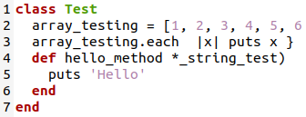
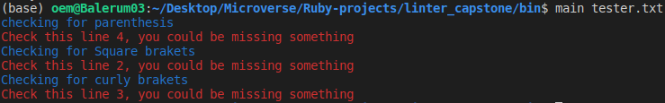
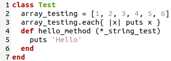
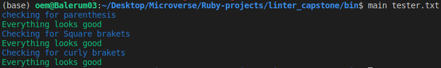

# linter_capstone
This project consists in the development of a basic linter, in this case I choose to validate in a given file if all of the parenthesis, square brackets and curly brackets were properly close in each line.  

## This is an example of some bad code and the output you can get when using the linter I created.

## This is an example of some right code and the output you can get when using the linter I created.

## Built With

- Ruby
- Rubocop
- Rspec

### Prerequisites

- Ruby must be Installed on your system
- Basic command line knowledge

### Setup

- Download or clone the repository
- Run a CLI and run `ruby main` on your local machine
- Additionally, You can go to https://repl.it and select language ruby, copy paste the code, and run it.

### How to use the linter
 You can run the basic linter just as shown in the image below, where the tester.rb can be you ruby file.

## Author

👤 **Adan Fernandez Bonilla**

- Github: [@balerum03](https://github.com/balerum03)
- Twitter: @balerum03
- Linkedin: [linkedin](https://www.linkedin.com/in/adan-fernandez-bonilla-4560831a5)

## 🤝 Contributing

Contributions, issues and feature requests are welcome!

Feel free to check the [issues page](https://github.com/balerum03/linter_capstone/issues).

## Show your support

Give a ⭐️ if you like this project!

## Acknowledgments

- Microverse
- GitHub
- TheOdinProject
- Ruby

## 📝 License

This project is [MIT](LICENSE) licensed.
