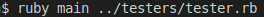

# linter_capstone
This project consists in the development of a basic linter, in this case I choose to validate in a given file if all of the parenthesis, square brackets and curly brackets were properly close in each line.  

## This is an example of some bad code and the output you can get when using the linter I created.


## This is an example of some right code and the output you can get when using the linter I created.


## Built With

- Ruby

### technology/gem used
- Rubocop
- colorize
- Rspec

### Prerequisites

- Ruby must be Installed on your system
- Basic command line knowledge

### Setup

- Download or clone the repository.
- Make sure that you have the gems require install in this case just colorize and rubocop.
- Run a CLI and run `ruby main test_file.rb` on your local machine.

### Run Test

- Once you have cloned the Repository, you would nedd to move to the folder where the project is located by running  ``` cd linter_capstone ```
(remember that you have take in consideration the location of the repo you just clone)
- When you get to project directory then run  ``` gem install colorize ```
- Then you move the bin directory by running ``` cd bin ```
- The only thing left to do is run the program by typing ``` ruby main file_to_be_tested.rb ``` (make sure the file you are testing is a ruby file with the .rb extension)
- One thing to notice is that the file_to_be_tested.rb has to be typied as the relative path for the file you want this program to analize.

### Basic instructions on how to use this linter.
 You can run the basic linter just as shown in the image below, where the tester_file.rb can be you ruby file (remeber to use relative path).

 The code shown on the image would work if you want to use the tester.rb file provided for testing on this repository.

## Author

👤 **Adan Fernandez Bonilla**

- Github: [@balerum03](https://github.com/balerum03)
- Twitter: [@balerum03](https://twitter.com/balerum03)
- Linkedin: [linkedin](https://www.linkedin.com/in/adan-fernandez-bonilla-4560831a5)

## 🤝 Contributing

Contributions, issues and feature requests are welcome!

Feel free to check the [issues page](https://github.com/balerum03/linter_capstone/issues).

## Show your support

Give a ⭐️ if you like this project!

## Acknowledgments

- Microverse
- GitHub
- TheOdinProject
- Ruby

## 📝 License


This project is [MIT](LICENSE) licensed.
